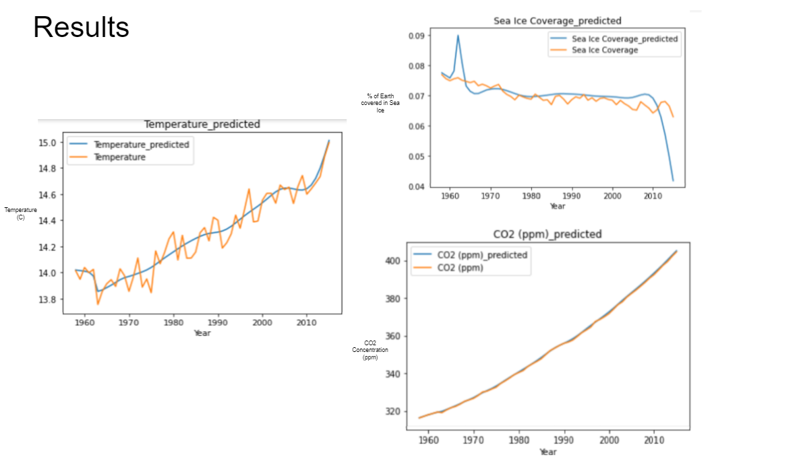
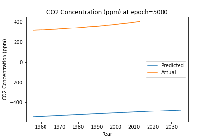
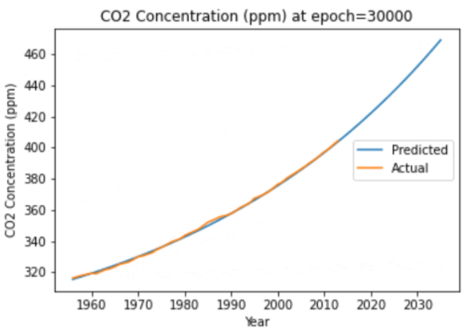

## Climate Forecasting Using Physics Informed Neural Networks

[Devpost](https://devpost.com/software/great-dynamics)
### Project Goal
Use Physics Informed Neural Networks to model the set of coupled differential equations that govern the patterns of Earth’s temperature, Ice coverage, and CO2 based on the data acquired during the last half-century
Using the the data recovered from our ML model make predictions about near future.

We used a new open-source Machine Learning library called [DeepXDE](https://deepxde.readthedocs.io/en/latest/) to find the constants in our ODE system using historical data of global average temperature, sea ice coverage, and carbon concentration. DeepXDE leverages Physics Informed Neural Networks (PINNs).

#### The ODE system:
T: Global Mean Temperature

I: Percentage of Sea Ice Coverage

E: CO2 concentration (ppm)

$$
\begin{aligned}
&\frac{d T}{d t}=q(1-(\alpha_1 + \alpha_2 S))-(\epsilon_1+\epsilon_2 E)\sigma_{SB} T^{4}
\\
&\frac{d S}{d t}=\beta-a T \\
&\frac{d E}{d t}=b E+k
\end{aligned}
$$
The alpha terms represent albedo, which we estimate is a linear function of sea ice.
The epsilon terms represent the greenhouse effect, which we estimate is a linear function of CO2 concentration.

#### Data:
Temperature and Sea Ice Coverage data from the [World Meteorological Organization](https://climexp.knmi.nl/selectfield_obs2.cgi?id=someone@somewhere). CO2 Data from [Datahub.io](https://datahub.io/core/co2-ppm).

#### Using Physics Informed Neural Networks to find the constants in the ODE system:

Evolution of the model during training.

CO2 concentration prediction from model. 455 ppm by 2030.

### Conclusion
We employed Physics Informed Neural Networks to develop an ODE system that models the global mean temperature, sea ice coverage, and CO2 concentration. It choose correct constants to model the data. As expected, we found that climate change is a pressing issue and carbon emissions appear to have no sign of slowing down.

### Sources
Flath D., Kaper H., Wattenberg F., Widiasih E. Energy Balance Models (2012) [Link](http://archive.dimacs.rutgers.edu/MPE/Energy/DIMACS-EBM.pdf)

Lu, L., Meng, Mao, Z.,  Karniadakis, G., DeepXDE: A Deep Learning Library For Solving Differential Equations (2020) [Link](https://arxiv.org/pdf/1907.04502.pdf)

World Meteorological Organization [Link](https://climexp.knmi.nl/selectfield_obs2.cgi?id=someone@somewhere)

DataHub.io, CO2 PPM - Trends in Atmospheric Carbon Dioxide [Link](https://datahub.io/core/co2-ppm)
